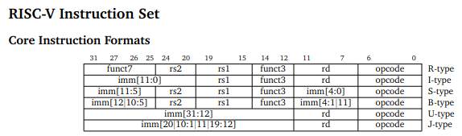

# CASM

RV32I Assembly in Python just for fun. 

No dudo ni por un segundo que se puede hacer eficiente,
pero mientras se aprende con que sea :sparkles: funcional :sparkles: basta por ahora :blush:.

# Supported Instruction

- [x] R type
- [ ] U type
- [ ] I Type
- [ ] B Type
- [ ] S Type
- [ ] J Type

> Someday pseudoinstructions will be supported

# Pseudo instructions not supported yet

# Respeten la ABI  o

# Useful links

- [RISC-V Instruction Encoder/Decoder](https://luplab.gitlab.io/rvcodecjs/#q=lui&abi=false&isa=AUTO)
- [RISC-V Reference 1](https://www.cs.sfu.ca/~ashriram/Courses/CS295/assets/notebooks/RISCV/RISCV_CARD.pdf)
- [RISC-V Reference 2](https://www.rose-hulman.edu/class/csse/csse232/pdf/RISCV_Green_Card.pdf)

# Credits

- Heavily inspired by [SharpRISCV](https://github.com/rizwan3d/SharpRISCV).
- [riscv example codes](https://marz.utk.edu/my-courses/cosc230/book/example-risc-v-assembly-programs/).
